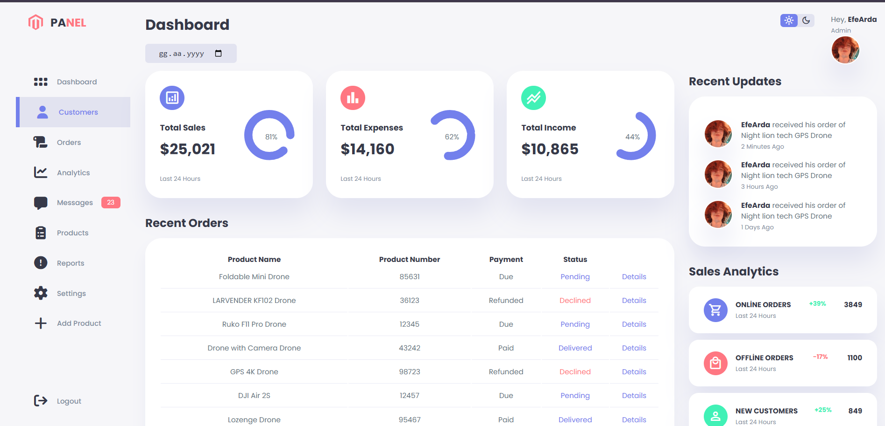

# Admin Panel Dashboard

This project is an Admin Panel Dashboard interface developed using HTML, CSS, and JavaScript, featuring a modern and fully responsive design.

 ## 🔗 Live Demo

Click the link below to view the live project:
[**Live Preview (Vercel)**](https://admin-panel-dashboardx.vercel.app/)

## ℹ️ About the Project

This dashboard is designed to serve as a foundation for web-based management systems. Built entirely with pure HTML, CSS, and JavaScript, it has no library dependencies and is highly customizable.

### Key Features

* **Responsive Design:** Fully compatible interface for mobile, tablet, and desktop devices.
* **Modern UI:** Clean code structure and modern CSS techniques.
* **Dynamic Content:** Dynamic orders table populated via JavaScript (`orders.js`).
* **Easy Integration:** Its pure JavaScript structure allows for easy integration with various backend systems.

## 🛠️ Technologies Used

* **HTML5:** Semantic structure.
* **CSS3:** Styling and layout (Grid & Flexbox).
* **JavaScript (ES6+):** DOM manipulation and data management.

## 🚀 Installation and Usage

You can follow the steps below to run the project locally. No package manager (npm, yarn, etc.) is required.

1.  **Clone the Repository:**
    ```bash
    git clone [https://github.com/EfeArdaKaplan/Admin-Panel-Dashboard.git](https://github.com/EfeArdaKaplan/Admin-Panel-Dashboard.git)
    ```

2.  **Navigate to the Directory:**
    ```bash
    cd Admin-Panel-Dashboard
    ```

3.  **Run:**
    Simply open the `index.html` file in your browser. (If you are using VS Code, using the "Live Server" extension is recommended).

## 📂 Project Structure

```text
Admin-Panel-Dashboard/
├── images/       # Project images and icons
├── index.html    # Main HTML file
├── style.css     # Stylesheet
├── script.js     # Basic JS functions (Toggles, interactions)
└── orders.js     # Sample data set (Orders array)
